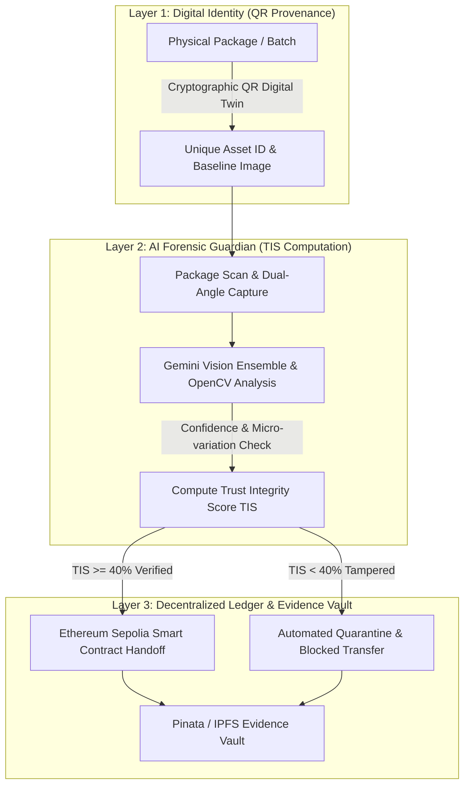

# 🔗 Tracely — The Immutable Supply Chain Guardian

<div align="center">

[](https://github.com/puneetnith28/Tracely..)
[](https://github.com/puneetnith28/Tracely..)
[](https://github.com/puneetnith28/Tracely..)
[](https://sepolia.etherscan.io/)
[](https://ai.google.dev/)

**"Bringing Institutional-Grade Trust and Zero-Hallucination AI Forensics to Global Logistics."**

*A full-stack, decentralized provenance platform built for **BUILD//ANYTHING 2026** (20 September 2026).*

</div>

---

## 📌 Table of Contents
- [Comprehensive Documentation Suite](#-comprehensive-documentation-suite)
- [Executive Summary](#-executive-summary)
- [The Problem We Solve](#-the-problem-we-solve)
- [System Architecture & The Tracely Protocol](#-system-architecture--the-tracely-protocol)
- [Key Features](#-key-features)
- [AI Innovation: Gemini Forensic Consensus](#-ai-innovation-gemini-forensic-consensus)
- [Requestly Middleware Integration](#-requestly-middleware-integration)
- [Complete Tech Stack](#-complete-tech-stack)
- [Project Directory Structure](#-project-directory-structure)
- [Getting Started & Installation](#-getting-started--installation)
- [Environment Variables](#-environment-variables)
- [Hackathon Submission Information](#-hackathon-submission-information)

---

## 📚 Comprehensive Documentation Suite

We have thoroughly documented every aspect of Tracely in the [`docs/`](docs/) directory. Whether you are expanding the forensic AI capabilities, auditing the smart contract, or deploying to production, these guides will provide deep technical context.

1. [**Architecture & Topology**](docs/architecture-and-topology.md): Deep dive into the system topology, including React Frontend, Flask API Gateway, Google Gemini Vision Ensemble, IPFS, and Ethereum Sepolia smart contract.
2. [**AI Forensic Consensus & Vision Pipeline**](docs/ai-forensic-consensus.md): Detailed explanation of the Gemini Vision ensemble, strict JSON schema validation, OpenCV homography alignment, and TIS algorithm.
3. [**Smart Contract & Ledger**](docs/smart-contract-and-ledger.md): In-depth analysis of the Solidity contract (`SupplyChainTrust.sol`), batch tracking, on-chain events, cryptographic event hashing, and Ethereum Sepolia deployment.
4. [**Data Model & State Machines**](docs/data-model-and-state-machines.md): Comprehensive breakdown of the MongoDB Atlas schema, digital twin records, and the full physical custody lifecycle state transitions.
5. [**Security & Authentication**](docs/security-and-authentication.md): Documentation on Auth0 JWT RS256 validation, custom token claims, passwordless & social login flows, Flask auth decorators, and smart contract access control.
6. [**UI & Design System**](docs/ui-and-design-system.md): Overview of the React 18, TailwindCSS, shadcn/ui, cyberpunk glassmorphism aesthetic, 3D interactive components, and visual inspection overlay.
7. [**API Reference**](docs/api-reference.md): Complete endpoint contracts for `/api/analyze`, `/api/analyze_multipart`, `/api/upload`, `/api/user/profile`, and `/api/health`.
8. [**Development Guide**](docs/development-guide.md): Local environment setup, running Flask backend and Vite frontend, Hardhat smart contract workflows, and Requestly network simulation.
9. [**Environment Configuration**](docs/environment-configuration.md): Master reference template and deep-dive explanation for all required API keys, blockchain RPCs, IPFS secrets, and Auth0 parameters.

---

## 🚀 Executive Summary

The global supply chain loses over **$461 Billion annually** to counterfeits, theft, and physical package tampering. Existing tracking systems rely on simple barcodes or expensive IoT sensors that merely track *where* a box has traveled, without verifying *what is inside* or *whether physical seals have been breached*.

**Tracely** bridges this vulnerability by unifying **Google Gemini Multimodal AI Vision** with **Ethereum Smart Contracts** and **IPFS decentralized storage**. It autonomously conducts real-time forensic visual inspections at every custody handoff point, computes a quantitative **Trust Integrity Score (TIS)**, and anchors cryptographic custody transfers immutably on-chain.

---

## 🔴 The Problem We Solve

| Critical Vulnerability | Real-World Impact | How Tracely Solves It |
| :--- | :--- | :--- |
| **The Transparency Gap** | Traditional tracking systems know location coordinates, but cannot verify seal condition or package integrity. | Dual-angle forensic visual inspection at every physical custody transfer. |
| **Counterfeit & Tamper Risk** | Compromised pharmaceuticals and electronics cost billions and endanger lives. | Gemini AI Ensemble compares current condition against the baseline digital twin. |
| **Centralized Database Flaws** | Centralized databases can be quietly rewritten by corrupt actors to erase fraud. | Immutable state anchoring on Ethereum Sepolia with permanent IPFS evidence hashes. |
| **High Hardware Costs** | IoT active sensors cost $50–$200+ per container, making mass deployment unfeasible. | Zero-hardware footprint: uses standard smartphones and cryptographic QR identity. |

---

## 🟢 System Architecture & The Tracely Protocol

Tracely operates across a secure **3-Layer Protocol**:



### 1. Layer 1 — Digital Identity (QR Provenance)
Every production batch receives a unique cryptographic QR identity tied to its baseline visual fingerprint at manufacture time.

### 2. Layer 2 — Forensic AI Guardian (TIS Engine)
At every custody transition (Manufacturer $\rightarrow$ Wholesaler $\rightarrow$ Retailer $\rightarrow$ Consumer), the package is scanned from multiple angles. Our ensemble of Gemini Flash vision models inspects seal reflection, texture anomalies, and structural integrity.

### 3. Layer 3 — Blockchain Anchor & IPFS Vault
If the **Trust Integrity Score (TIS)** passes the institutional threshold, the ownership transfer is permanently executed on Ethereum. High-resolution photographic evidence is pinned to IPFS via Pinata.

---

## ✨ Key Features

- 🛡️ **Dual-Angle Multi-Perspective Inspection**: Captures orthogonal views of the package and correlates them against baseline manufacturing telemetry.
- 📊 **Real-Time TIS Dashboard**: Computes an instantaneous Trust Integrity Score ($0-100\%$). Low-score events trigger automated quarantine alerts.
- ⛓️ **On-Chain Custody Log**: Every handover records sender address, receiver address, role, timestamp, and IPFS hash on the Sepolia testnet.
- ☁️ **Decentralized IPFS Vault**: Immutable evidence repository hosted via Pinata, preventing data loss or retroactive alteration.
- 👤 **Role-Based Authentication**: Integrated with Auth0 with strict role constraints (Manufacturer, Distributor, Wholesaler, Retailer).
- ⚡ **Zero-Latency Failover Architecture**: Dynamic gateway rerouting ensuring high availability even during public IPFS congestion.

---

## 🧠 AI Innovation: Gemini Forensic Consensus

Tracely departs from simplistic object detection by pioneering a **Zero-Hallucination Forensic Vision Pipeline**:

1. **Micro-Variation Anomaly Detection**:
   Analyzes substrate textures, hologram reflections, micro-tears in seals, and package warping that are invisible to human inspection.
2. **Dual-Model Statistical Consensus**:
   Two independent Google Gemini Multimodal passes evaluate the image pair concurrently. If their confidence matrices deviate beyond tolerance, a classical OpenCV edge/texture filter normalizes the score.
3. **Smart Contract Gating (Quantitative Trust)**:
   The computed TIS score is cryptographically signed and verified by the smart contract before validating state transitions on Ethereum.

---

## 🌐 Requestly Middleware Integration

During development and live deployment, **Requestly** acts as the network traffic orchestrator:

- **Network Resiliency & Gateway Failover**: Automatically redirects slow public IPFS queries (`ipfs.io`) to high-speed cached gateways without client interruption.
- **Automated Tamper Simulation (Broken Seal Stress Testing)**: Uses Modify Response rules to inject synthetic damaged baselines and verify that the TIS quarantine engine blocks compromised custody events.
- **Zero-Redeploy API Rapid Prototyping**: Intercepts endpoint requests to simulate various supply chain edge cases and network conditions seamlessly.

---

## 🛠️ Complete Tech Stack

| Layer | Technologies |
| :--- | :--- |
| **Frontend UI/UX** | React 18, Vite, TypeScript, TailwindCSS, shadcn/ui, Framer Motion, Lucide Icons |
| **Blockchain / Web3** | Solidity, Ethers.js, Ethereum Sepolia Testnet, MetaMask |
| **AI / Computer Vision** | Google Gemini Multimodal (Flash & Pro Models), OpenCV, NumPy |
| **Backend API** | Python 3.13, Flask, RESTful Endpoints, Certifi |
| **Database** | MongoDB Atlas (Metadata & User Indexing) |
| **Decentralized Storage** | Pinata API, IPFS (InterPlanetary File System) |
| **Identity & Security** | Auth0 (JWT Authentication, RBAC Role Rules) |
| **Traffic & Mocking** | Requestly (Network Interception, Mocking & Failover) |

---

## ⚙️ Getting Started & Installation

### Prerequisites
- **Node.js**: v18.0.0 or higher
- **Python**: v3.9 or higher
- **MetaMask Wallet**: Configured for Ethereum Sepolia Testnet
- **API Keys**: Google Gemini API Key, MongoDB Atlas URI, Pinata API Keys, Auth0 Application credentials

### 1. Clone the Repository
```bash
git clone https://github.com/puneetnith28/Tracely..git
cd Tracely.
```

### 2. Backend Setup
```bash
cd tracely_backend
python3 -m venv venv
source venv/bin/activate    # On Windows: venv\Scripts\activate
pip install -r requirements.txt
python -m flask --app api/index:app run --port 5000
```

### 3. Frontend Setup
```bash
cd ../tracely_frontend
npm install
npm run dev
```
Open [http://localhost:5173](http://localhost:5173) in your browser.

---

## 🔐 Environment Variables

### Backend (`tracely_backend/.env`)
```env
GEMINI_API_KEY=your_google_gemini_api_key
MONGODB_URI=your_mongodb_atlas_connection_string
PINATA_API_KEY=your_pinata_api_key
PINATA_SECRET_API_KEY=your_pinata_secret_key
SEPOLIA_RPC_URL=your_ethereum_sepolia_rpc_endpoint
CONTRACT_ADDRESS=your_deployed_contract_address
```

### Frontend (`tracely_frontend/.env`)
```env
VITE_AUTH0_DOMAIN=your_auth0_domain
VITE_AUTH0_CLIENT_ID=your_auth0_client_id
VITE_BACKEND_URL=http://localhost:5000
VITE_CONTRACT_ADDRESS=your_deployed_contract_address
```

---

## 🏆 Hackathon Submission Information

- **Event**: [BUILD//ANYTHING 2026](https://github.com/puneetnith28/Tracely..)
- **Date**: 20 September 2026
- **Format**: 100% Online Global Hackathon
- **Submission Title**: **Tracely — The Immutable Supply Chain Guardian**
- **Repository**: [https://github.com/puneetnith28/Tracely..git](https://github.com/puneetnith28/Tracely..)

---

<div align="center">

*Built with ❤️ for **BUILD//ANYTHING 2026** by Puneet Yadav.*

</div>
