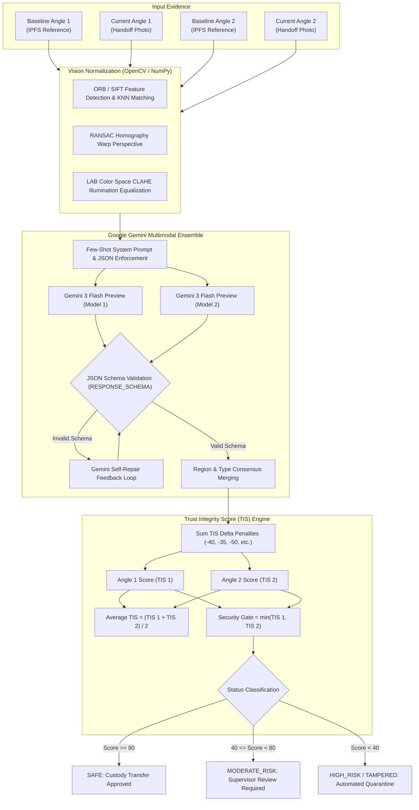

# 🧠 AI Forensic Consensus & Vision Pipeline

## Executive Overview

Tracely eliminates supply chain inspection blind spots by combining multimodal generative artificial intelligence with classical computer vision algorithms. Rather than relying on simple barcode scanners or manual visual checks, Tracely performs a **Zero-Hallucination Forensic Vision Pipeline** comparing real-time photographic evidence against the package's baseline digital twin created at manufacture time.

---

## The AI Vision Pipeline Architecture

### 1. Dual-Angle Orthogonal Capture
Physical package tampering is often directional—seals may be sliced from the top while the front label remains pristine. Tracely enforces orthogonal multi-angle capture:
* **Angle 1**: Top edge, seal seam, tape continuity, and upper closures.
* **Angle 2**: Side/front face, barcode/QR label clarity, substrate texture, and typography.

### 2. Gemini Multimodal Ensemble (`ai.py`)
Both images (Baseline and Current) are encoded and dispatched concurrently to Google Gemini Vision models (`gemini-3-flash-preview`).
* **Generation Hyperparameters**:
  * `temperature`: `0.15` (low randomness to prevent hallucinations)
  * `top_k`: `20`
  * `top_p`: `0.8`
  * `response_mime_type`: `application/json`

### 3. Strict Schema Validation & Self-Repair
Responses are strictly parsed against `RESPONSE_SCHEMA` using Python's `jsonschema` library. If a model output violates the expected schema, the payload is fed into a secondary Gemini self-repair prompt to normalize keys and guarantee zero runtime deserialization crashes.

---

## Micro-Variation Anomaly Taxonomy

Each detected anomaly is categorized into a standardized taxonomy with an associated **TIS Delta** penalty:

| Anomaly Type | Severity | TIS Delta | Description & Indicators |
| :--- | :--- | :--- | :--- |
| `digital_edit` | **HIGH** | `-50` | Synthetic alterations, photo cloning, digital artifacting, or spoofed images. |
| `seal_tamper` | **HIGH** | `-40` | Broken, lifted, cut, or misaligned tamper-evident tape or adhesive seals. |
| `label_mismatch` | **HIGH** | `-40` | Altered, replaced, blurry, or counterfeit batch/serial labels. |
| `repackaging` | **HIGH** | `-35` | Inconsistent box dimensions, non-OEM cardboard, or structural packaging swap. |
| `missing_item` | **HIGH** | `-20` | Absent components, void fill displacement, or broken inner blisters. |
| `dent` | **MEDIUM** | `-15` | Structural compression, corner collapse, or impact deformities. |
| `scratch` | **LOW** | `-8` | Surface abrasions, superficial cosmetic scuffs on outer substrate. |
| `stain` | **LOW** | `-5` | Fluid discoloration, moisture marks, or superficial grease spots. |
| `color_shift` | **LOW** | `-5` | Minor UV fading or ambient lighting color variations. |

---

## Classical Computer Vision Normalization (`vision.py`)

When comparing two photos taken under different warehouse lighting and phone camera angles, raw pixel subtraction fails. Tracely employs an advanced OpenCV pipeline:

### 1. Feature Alignment (Homography)
1. Extracts keypoints using `cv2.ORB_create(nfeatures=1500)` and `cv2.SIFT_create(nfeatures=1000)`.
2. Computes bidirectional K-Nearest Neighbors (`KNNMatch`) with strict Lowe's ratio test ($d_1 < 0.7 \cdot d_2$).
3. Calculates the $3 \times 3$ Homography matrix $H$ using `cv2.findHomography` with RANSAC outlier rejection ($3.0$ pixel threshold, max 2000 iterations).
4. Warps the current image into the baseline perspective via `cv2.warpPerspective`.

### 2. Illumination Normalization (CLAHE in LAB Space)
1. Converts BGR images to the perceptual **CIE-L\*a\*b\*** color space.
2. Applies **Contrast Limited Adaptive Histogram Equalization (CLAHE)** with `clipLimit=3.0` and `tileGridSize=(8, 8)` to the L-channel (Luminance).
3. Converts back to BGR and blends with equalized grayscale intensity ($80\% / 20\%$) to preserve edge contrast while eliminating harsh shadows and flash glare.

---

## Trust Integrity Score (TIS) Mathematical Formulation

For each angle view $v \in \{1, 2\}$, the view Trust Integrity Score is calculated as:

$$\text{TIS}_v = \max\left(0, \min\left(100, 100 + \sum_{i \in \text{Diffs}_v} \Delta_i \cdot \text{conf}_i \right)\right)$$

Where:
* $\Delta_i \le 0$ is the penalty delta for difference item $i$.
* $\text{conf}_i \in [0.0, 1.0]$ is the model's confidence in that anomaly.

### Dual-Angle Aggregation & Worst-Case Gating:
* **Reported Aggregate TIS**:
  $$\text{TIS}_{\text{agg}} = \left\lfloor \frac{\text{TIS}_1 + \text{TIS}_2}{2} + 0.5 \right\rfloor$$
* **Security Gate Decision Metric**:
  $$\text{TIS}_{\text{gate}} = \min(\text{TIS}_1, \text{TIS}_2)$$

### Institutional Decision Thresholds:
* **$\text{TIS}_{\text{gate}} \ge 80\%$** $\rightarrow$ **`SAFE`**: Handover verified; custody transaction permitted on Ethereum Sepolia.
* **$40\% \le \text{TIS}_{\text{gate}} < 80\%$** $\rightarrow$ **`MODERATE_RISK`**: Supervisor review requested; flagged on timeline.
* **$\text{TIS}_{\text{gate}} < 40\%$** $\rightarrow$ **`HIGH_RISK` (QUARANTINE)**: Critical security breach detected (seal tamper or digital edit); smart contract handoff **permanently blocked**.
