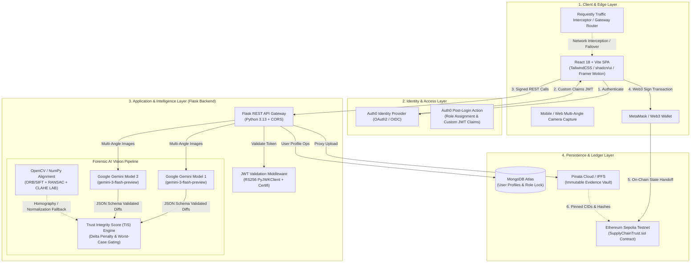
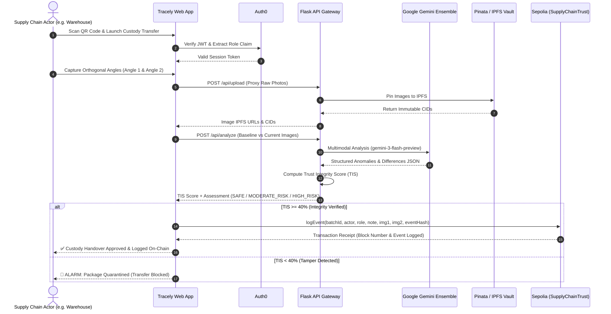

# 🏗️ Architecture & Topology

## Executive Overview

**Tracely** is an institutional-grade, decentralized supply chain provenance and physical package integrity verification platform. It converges **Google Gemini Multimodal AI Vision**, **Ethereum Smart Contracts (Sepolia)**, **Decentralized Storage (IPFS / Pinata)**, **Auth0 Identity & RBAC**, and **MongoDB Atlas** into an immutable 3-layer security protocol.

---

## Component Topology Deep Dive

### 1. Client & Presentation Layer
* **Framework**: React 18 with TypeScript and Vite for near-instant HMR.
* **Component Library**: Radix UI primitives styled with TailwindCSS and `shadcn/ui`.
* **State & Query**: TanStack React Query (`@tanstack/react-query`) for asynchronous data fetching and cache invalidation.
* **Web3 Integration**: Ethers.js v6 for contract interaction, wallet lifecycle management, and ABI encoding.
* **Camera / Dual-Perspective Capture**: HTML5 environment-facing video stream integration with multi-angle capture guidance (Angle 1: Top/Seam, Angle 2: Side/Label).

### 2. Identity & Access Management (IAM)
* **Provider**: Auth0 by Okta.
* **Tokens**: RS256-signed JSON Web Tokens containing custom namespace claims (`https://tracely.app/role`).
* **Roles**: `MANUFACTURER`, `DISTRIBUTOR`, `WAREHOUSE`, `RETAILER`, `CONSUMER`.
* **Serverless Action**: Post-login Auth0 Action automatically assigns roles for passwordless email authentication and maps OAuth2 claims.

### 3. Application & Forensic Vision Backend
* **Runtime**: Python 3.13 / Flask.
* **Security Middleware**: RS256 JWKS token validation with automatic key rotation lookup and macOS SSL certifi patch.
* **AI Vision Engine**: Google Gemini Multimodal API (`google-generativeai`) querying dual models in an ensemble configuration.
* **Computer Vision Normalization**: OpenCV headless (`cv2`) and NumPy for feature-based Homography (ORB/SIFT + RANSAC) and LAB color-space CLAHE illumination normalization.
* **IPFS Proxy**: Secure backend multipart proxy uploading package evidence to Pinata Cloud without exposing API secrets to the client.

### 4. Decentralized Ledger & Storage
* **Smart Contract**: `SupplyChainTrust.sol` deployed on Ethereum Sepolia testnet.
* **Cryptographic Event Hash**: Keccak256 / SHA256 hashes generated over `(batchId, timestamp, actor, role, firstViewImage, secondViewImage, note)`.
* **Decentralized Storage**: Pinata IPFS nodes anchoring dual-angle photographic evidence under immutable CIDs (`ipfs://<CID>`).

---

## End-to-End Sequence Flow

The following sequence diagram details the full lifecycle of a physical package custody transfer under Tracely verification:

---

## Network Resiliency & Requestly Layer

To guarantee institutional uptime and simulate failure edge cases during quality assurance, Tracely leverages **Requestly**:
1. **IPFS Gateway Failover**: Intercepts `ipfs.io` public gateway timeouts and dynamically reroutes to high-speed dedicated Pinata endpoints (`https://gateway.pinata.cloud/ipfs/`).
2. **Tamper Stress Testing**: Injects modified response payloads into the `/api/analyze` route to verify that frontend quarantine gates and UI alert banners activate with zero false negatives.
3. **Latency Simulation**: Simulates edge-network degraded connectivity at remote shipping ports and loading docks.
