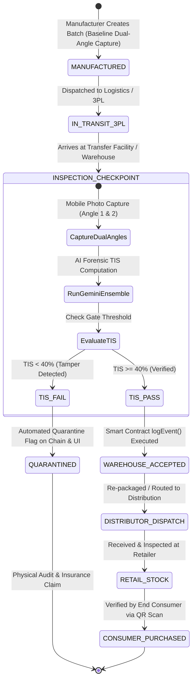

# 📊 Data Model & State Machines

## Executive Overview

Tracely enforces a hybrid data model: off-chain identity and user profiles are stored in **MongoDB Atlas**, immutable evidence images are archived on **IPFS**, and verifiable custody states and provenance events are recorded on the **Ethereum Blockchain**.



---

## 1. MongoDB Atlas Schema (`tracely.users`)

The MongoDB user collection maintains operational identity, persistent user roles, and login history synchronized with Auth0:

```json
{
  "$jsonSchema": {
    "bsonType": "object",
    "required": ["sub", "email", "created_at", "last_login"],
    "properties": {
      "sub": {
        "bsonType": "string",
        "description": "Auth0 unique subject identifier (e.g. 'google-oauth2|123456' or 'auth0|67890'). Primary lookup key."
      },
      "email": {
        "bsonType": "string",
        "description": "Normalized email address of the operator."
      },
      "name": {
        "bsonType": "string",
        "description": "Full display name."
      },
      "picture": {
        "bsonType": "string",
        "description": "Avatar image URL provided by Auth0/OAuth provider."
      },
      "role": {
        "bsonType": ["string", "null"],
        "enum": ["MANUFACTURER", "DISTRIBUTOR", "WAREHOUSE", "RETAILER", "CONSUMER", null],
        "description": "Immutable enterprise role. Once assigned and locked, cannot be overridden by client requests."
      },
      "created_at": {
        "bsonType": "string",
        "description": "ISO 8601 UTC timestamp of account creation."
      },
      "last_login": {
        "bsonType": "string",
        "description": "ISO 8601 UTC timestamp of most recent authentication."
      }
    }
  }
}
```

### Role Locking Invariant
To prevent privilege escalation attacks in the field:
1. When a new user authenticates, their profile is initialized via `upsert_user`.
2. Once a valid `role` is assigned via `set_role`, the backend **refuses subsequent modifications** to that field unless executed through administrative database procedures.

---

## 2. On-Chain State Entity Models

### Digital Twin Model (`Batch`)
Stored in contract storage mapping `batches[batchId]`:
```typescript
interface BatchDigitalTwin {
  id: string;                  // Unique Batch Identifier (e.g. "VAX-2026-992")
  productName: string;         // Descriptive product title
  sku: string;                 // Global SKU code
  origin: string;              // Manufacturer facility name / geo-origin
  createdAt: string;           // Block timestamp converted to ISO 8601
  firstViewBaseline: string;   // IPFS URL/CID of primary baseline perspective
  secondViewBaseline: string;  // IPFS URL/CID of secondary baseline perspective
  creator: string;             // Ethereum address of creating entity
  exists: boolean;             // Integrity existence boolean
}
```

### Chronological Event Entity (`BatchEvent`)
Stored in contract storage mapping `batchEvents[batchId]`:
```typescript
interface CustodyEvent {
  id: number;                  // Sequential event index
  actor: string;               // Corporate entity name (e.g. "FedEx Freight Hub #4")
  role: UserRole;              // Role at time of custody handover
  timestamp: number;           // Unix epoch timestamp from block header
  note: string;                // Forensic log notes and inspector observations
  firstViewImage: string;      // IPFS URL/CID of primary perspective photo
  secondViewImage: string;     // IPFS URL/CID of secondary perspective photo
  eventHash: string;           // SHA-256 / Keccak256 cryptographic proof hash
  loggedBy: string;            // Ethereum wallet address of the inspecting operator
}
```

---

## 3. Role-Based Access Control (RBAC) Matrix

| Action | `MANUFACTURER` | `DISTRIBUTOR` | `WAREHOUSE` | `RETAILER` | `CONSUMER` |
| :--- | :---: | :---: | :---: | :---: | :---: |
| **Create Batch Digital Twin** | ✅ Allowed | ❌ Denied | ❌ Denied | ❌ Denied | ❌ Denied |
| **Log Custody Handover Event** | ✅ Allowed | ✅ Allowed | ✅ Allowed | ✅ Allowed | ❌ Denied |
| **Execute AI Forensic Analysis** | ✅ Allowed | ✅ Allowed | ✅ Allowed | ✅ Allowed | ✅ Allowed |
| **View Provenance Timeline** | ✅ Allowed | ✅ Allowed | ✅ Allowed | ✅ Allowed | ✅ Allowed |
| **Authorize Contract Operators** | Owner Only | ❌ Denied | ❌ Denied | ❌ Denied | ❌ Denied |
| **Inspect Digital Twin via QR** | ✅ Allowed | ✅ Allowed | ✅ Allowed | ✅ Allowed | ✅ Allowed |

---

## 4. Dual-Perspective Forensic State Engine

At any point of interest, the state of a package comparison is modeled as:

```typescript
interface ForensicAnalysisState {
  aggregate_tis: number; // 0 to 100
  overall_assessment: "SAFE" | "MODERATE_RISK" | "HIGH_RISK";
  confidence_overall: number; // 0.0 to 1.0
  notes: string;
  differences: Array<{
    id: string;
    region: string;
    bbox: [number, number, number, number] | null; // [x, y, width, height]
    type: "seal_tamper" | "dent" | "scratch" | "label_mismatch" | "repackaging" | "digital_edit" | "stain" | "color_shift" | "missing_item";
    description: string;
    severity: "HIGH" | "MEDIUM" | "LOW";
    confidence: number;
    explainability: string[];
    suggested_action: string;
    tis_delta: number;
  }>;
  analysis_metadata: {
    total_differences: number;
    high_severity_count: number;
    medium_severity_count: number;
    low_severity_count: number;
    angle_1_tis: number;
    angle_2_tis: number;
    angle_tis_min: number;
    scoring_version: string;
  };
}
```
