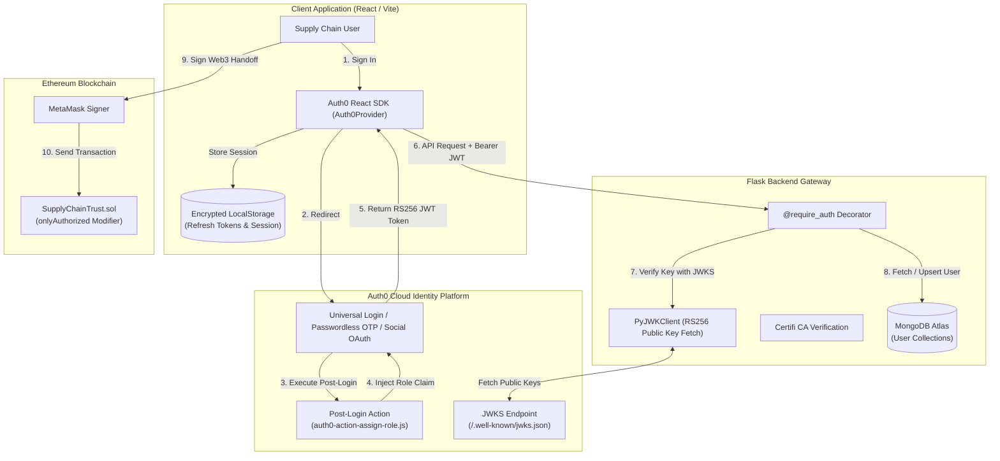

# 🔒 Security & Authentication

## Executive Overview

Tracely implements end-to-end security spanning cryptographic Web3 authentication, enterprise **Auth0 Identity Federation (OIDC/OAuth2)**, RS256 token verification, role-based backend authorization decorators, and smart contract access gating.



---

## 1. Auth0 Authentication & Token Lifecycle

### Token Specifications
* **Signature Algorithm**: `RS256` (Asymmetric RSA Signature with SHA-256).
* **Audience**: Configured via `AUTH0_AUDIENCE` / `VITE_AUTH0_AUDIENCE`.
* **Issuer**: `https://<AUTH0_DOMAIN>/`.
* **Custom Namespace**: `https://tracely.app/`.

### Custom Claims Structure
When decoded, the Auth0 JWT includes verified identity attributes:
```json
{
  "iss": "https://dev-tij06cqg4bb0xmn5.us.auth0.com/",
  "sub": "google-oauth2|109283746501928374650",
  "aud": "https://tracely.app/api",
  "iat": 1774100000,
  "exp": 1774186400,
  "email": "operator@logistics-apex.com",
  "email_verified": true,
  "https://tracely.app/role": "WAREHOUSE"
}
```

---

## 2. Serverless Auth0 Action (`auth0-action-assign-role.js`)

Deployed within the Auth0 Login Flow to ensure deterministic role propagation:
* **Passwordless Email Logins**: Automatically assigns the default `WAREHOUSE` operational role.
* **Social / Enterprise OAuth Logins**: Preserves existing `app_metadata` or pre-selected user metadata.
* **Token Claim Injection**: Automatically writes `${namespace}/role` to both the `idToken` (for frontend UI rendering) and the `accessToken` (for Flask backend endpoint verification).

```javascript
exports.onExecutePostLogin = async (event, api) => {
  const namespace = 'https://tracely.app';
  const connectionName = event.connection.name || '';
  const isPasswordless = connectionName === 'email' || event.connection.strategy === 'email';
  
  let role = event.user.app_metadata?.role || event.user.user_metadata?.role;
  
  if (!role && isPasswordless) {
    role = 'WAREHOUSE';
    api.user.setUserMetadata('role', role);
  }
  
  if (role) {
    api.idToken.setCustomClaim(`${namespace}/role`, role);
    api.accessToken.setCustomClaim(`${namespace}/role`, role);
  }
};
```

---

## 3. Backend Verification Middleware (`auth.py`)

### Middleware Protections
1. **Asymmetric Key Retrieval**: Uses `PyJWKClient` to retrieve the signing public key from Auth0's JSON Web Key Set (`/.well-known/jwks.json`).
2. **Expiration & Audience Enforcement**: Validates that `exp > now()` and `aud == AUTH0_AUDIENCE`. Rejects spoofed or expired tokens with `401 Unauthorized`.
3. **macOS / Linux SSL Certification**: Injects `certifi.where()` into the SSL trust store to eliminate SSL handshake failures in containerized and Darwin environments.

### Route Decorators
* `@require_auth`: Restricts access to authenticated operators. Injects `request.user_id`, `request.user_email`, and `request.user_role` into the execution context.
* `@optional_auth`: Allows unauthenticated inspection queries while attaching user identity if a valid JWT is provided.

---

## 4. IPFS Proxy Security & Storage Isolation

To prevent exposing Pinata API keys and master JWTs on client browsers:
* **Server-Side File Proxying**: All image uploads route through `POST /api/upload`.
* **Payload Size Constraints**: The backend enforces a strict **16 MB maximum file size** limit before proxying to Pinata Cloud.
* **Memory Streaming**: Files are streamed directly from the incoming request buffer to Pinata without writing unencrypted temporary files to the disk.

---

## 5. Smart Contract Access Control Security

The `SupplyChainTrust` smart contract guarantees ledger integrity through strict programmatic guards:
* **Owner Multi-Sig Compatibility**: Contract ownership can be transferred to institutional Gnosis Safe multi-sig addresses via `transferOwnership(newOwner)` with zero-address validation (`require(newOwner != address(0))`).
* **Operator Whitelisting**: Handover events can only be logged by addresses explicitly authorized in `authorizedUsers` or by the contract owner.
* **Immutable History**: The contract contains no functions to delete batches or overwrite historical `BatchEvent` entries, preventing retroactive tampering.
