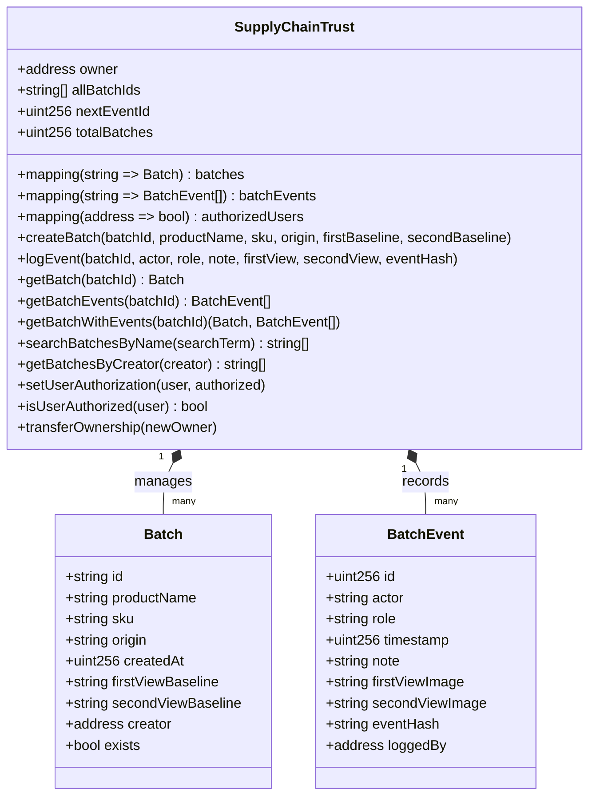

# ⛓️ Smart Contract & Ledger

## Executive Overview

The ledger tier of Tracely ensures that physical handovers, photographic evidence CIDs, and forensic trust assessments are anchored immutably on the **Ethereum Sepolia** testnet. This removes reliance on centralized databases that could be secretly altered or deleted by bad actors in the logistics chain.



---

## Contract Specification: `SupplyChainTrust.sol`

* **Solidity Version**: `^0.8.19`
* **License**: MIT
* **Network Target**: Ethereum Sepolia (`Chain ID: 11155111` / `0xaa36a7`)

### Core Data Structures

#### 1. `Batch` Struct
Represents the root digital twin of a manufactured production batch:
```solidity
struct Batch {
    string id;                  // Unique Batch Identifier (e.g. BATCH-2026-001)
    string productName;         // Product commercial name
    string sku;                 // Stock Keeping Unit / Part Number
    string origin;              // Manufacturing facility / origin location
    uint256 createdAt;          // Block timestamp of creation
    string firstViewBaseline;   // IPFS hash/URL for Angle 1 baseline
    string secondViewBaseline;  // IPFS hash/URL for Angle 2 baseline
    address creator;            // Ethereum address of the manufacturer
    bool exists;                // Existence flag
}
```

#### 2. `BatchEvent` Struct
Represents an individual physical custody handover or inspection checkpoint:
```solidity
struct BatchEvent {
    uint256 id;                 // Incremental event identifier
    string actor;               // Name of company/actor (e.g., "Apex Logistics")
    string role;                // Role ("Manufacturer", "3PL", "Warehouse", "Retailer")
    uint256 timestamp;          // Block timestamp when logged
    string note;                // Inspection summary / checkpoint notes
    string firstViewImage;      // IPFS hash/URL of Angle 1 handover photo
    string secondViewImage;     // IPFS hash/URL of Angle 2 handover photo
    string eventHash;           // Cryptographic hash over event parameters
    address loggedBy;           // Ethereum wallet of the inspecting operator
}
```

---

## Access Control & Modifiers

The contract implements strict role-based gating:
```solidity
modifier onlyOwner() {
    require(msg.sender == owner, "Only owner can call this function");
    _;
}

modifier onlyAuthorized() {
    require(authorizedUsers[msg.sender] || msg.sender == owner, "Unauthorized user");
    _;
}

modifier batchExists(string memory batchId) {
    require(batches[batchId].exists, "Batch does not exist");
    _;
}
```

### Authorization Management
* `setUserAuthorization(address user, bool authorized)`: Enables contract owners to whitelist enterprise supply chain operators (distributors, logistics hubs, quality inspectors).
* `isUserAuthorized(address user)`: Read-only check for UI access gatekeeping.

---

## Cryptographic Event Hashing

To ensure non-repudiation between the off-chain AI analysis and the on-chain ledger, an `eventHash` is computed prior to executing `logEvent`:

$$\text{EventHash} = \text{keccak256}\left(\text{batchId} \parallel \text{actor} \parallel \text{timestamp} \parallel \text{firstViewImage} \parallel \text{secondViewImage} \parallel \text{loggedBy}\right)$$

This guarantees that:
1. Photos cannot be retroactively substituted on IPFS.
2. The inspecting inspector cannot deny having submitted the evaluation.
3. The event data is immutably timestamped by Ethereum block consensus.

---

## State Transitions & Query Functions

| Function | Access | Description |
| :--- | :--- | :--- |
| `createBatch(...)` | `onlyAuthorized` | Creates a new batch with baseline IPFS hashes. Reverts if batch already exists. |
| `logEvent(...)` | `onlyAuthorized`, `batchExists` | Appends a custody handover event with photographic proof hashes. |
| `getBatch(batchId)` | `view`, `batchExists` | Returns full `Batch` struct for a specific identifier. |
| `getBatchEvents(batchId)` | `view`, `batchExists` | Returns chronological array of all `BatchEvent` entries. |
| `getBatchWithEvents(batchId)` | `view`, `batchExists` | Atomic fetch returning both batch digital twin and complete event timeline. |
| `searchBatchesByName(searchTerm)` | `view` | Case-insensitive search across all registered product names. |
| `getBatchesByCreator(creator)` | `view` | Returns all batch IDs minted by a specific manufacturer wallet. |

---

## IPFS Content Addressing & Pinata Vault

Tracely uses **Content Identifiers (CIDs)** to store high-resolution forensic images:
* **Upload Path**: Photos captured on mobile are proxied through `/api/upload` to Pinata Cloud via JWT authentication.
* **Immutability Guarantee**: IPFS CIDs are derived from the SHA-256 hash of the image bytes (`bafybeic...`). Any change to a single pixel produces an entirely different CID.
* **Storage Economy**: Storing CIDs on Ethereum requires only $\sim 64$ bytes of calldata per image, drastically minimizing Sepolia gas consumption while retaining tamper-proof integrity.
