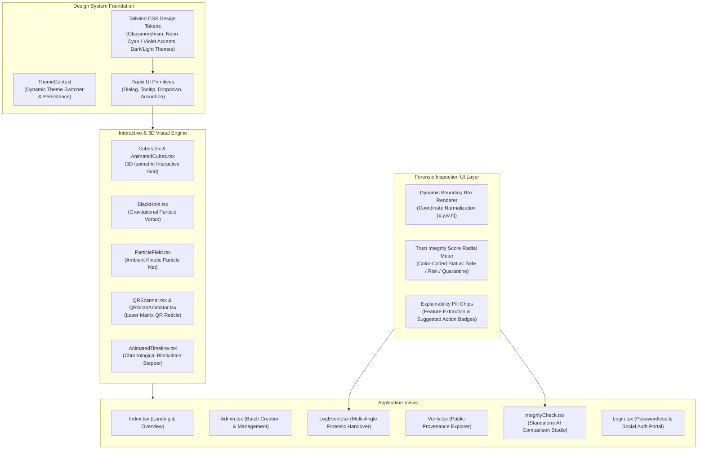

# 🎨 UI & Design System

## Executive Overview

Tracely is built with a high-performance **Futuristic Glassmorphism** design aesthetic tailored for industrial and supply chain mission-control environments. It utilizes **React 18**, **Vite**, **TypeScript**, **TailwindCSS**, **shadcn/ui**, and **Framer Motion** to deliver smooth 60fps micro-interactions, responsive 3D visualizers, and an intuitive forensic analysis dashboard.

---

## 1. Design Philosophy & Aesthetic Tokens

* **Glassmorphism & Depth**: Multi-layered backdrop blurs (`backdrop-blur-md` / `backdrop-blur-xl`), translucent background fills (`rgba(15, 23, 42, 0.75)`), and ultra-thin luminous borders (`border-cyan-500/20`).
* **Harmonious Palette**:
  * **Primary Neon**: Cyan (`#06b6d4` / `hsl(189, 94%, 43%)`) representing cryptographic security.
  * **Accent Glow**: Violet / Purple (`#8b5cf6` / `hsl(258, 90%, 66%)`) representing generative AI intelligence.
  * **Alert / Quarantine**: Rose / Crimson (`#f43f5e` / `hsl(349, 89%, 60%)`) denoting seal breaches and physical tampering.
  * **Success / Verified**: Emerald (`#10b981` / `hsl(158, 64%, 52%)`) denoting verified provenance and TIS $> 80\%$.
* **Typography**: Clean, geometric sans-serif type hierarchy paired with monospace typography for cryptographic hashes, batch IDs, and IPFS CIDs.

---

## 2. Interactive & 3D Visual Components

### `Cubes.tsx` / `AnimatedCubes.tsx`
* Renders a responsive 3D isometric matrix representing immutable decentralized blocks.
* Listens to mouse movement and cursor proximity to dynamically calculate perspective tilt and lighting shadows.

### `BlackHole.tsx`
* Canvas-driven particle physics simulation representing data ingestion and entropy reduction in the AI consensus pipeline.

### `QRScanner.tsx` & `QRScanAnimator.tsx`
* High-speed video stream decoder scanning physical batch QR codes.
* Overlays a high-tech glowing laser reticle with animated corner targeting brackets and audio-haptic feedback on successful detection.

### `AnimatedTimeline.tsx`
* Visualizes the complete blockchain custody chain.
* Each node expands to reveal timestamp, operator Ethereum wallet, role badge, inspection note, and dual-perspective IPFS image lightbox.

---

## 3. Forensic Inspection Overlay Engine

When an operator scans a package in `LogEvent.tsx` or `IntegrityCheck.tsx`, the UI superimposes real-time forensic detection layers:

1. **Bounding Box Normalization**:
   Transforms Gemini normalized coordinates `[x, y, w, h]` (range $0.0 \dots 1.0$) to absolute responsive pixel dimensions on the rendered canvas:
   $$\text{top} = y \times \text{height}_{\text{container}}, \quad \text{left} = x \times \text{width}_{\text{container}}$$
   $$\text{boxWidth} = w \times \text{width}_{\text{container}}, \quad \text{boxHeight} = h \times \text{height}_{\text{container}}$$

2. **Severity Highlighting**:
   * **`HIGH`** (Crimson dashed glow): For `seal_tamper`, `digital_edit`, `label_mismatch`.
   * **`MEDIUM`** (Amber border): For `dent`, `repackaging`.
   * **`LOW`** (Sky-blue border): For `scratch`, `stain`, `color_shift`.

3. **Explainability Chips**:
   Presents concise forensic reasoning tokens returned by the Gemini ensemble (e.g. `["gap at seam", "edge discontinuity", "lifted flap"]`).

---

## 4. Application Routes & Page Architecture

| Route | Component | Access Gate | Description |
| :--- | :--- | :--- | :--- |
| `/` | `Index.tsx` | Public | Hero showcase, interactive 3D demos, live statistics, and system overview. |
| `/login` | `Login.tsx` | Public | Auth0 Universal Login, passwordless email OTP, and social identity sign-in. |
| `/admin` | `Admin.tsx` | `ProtectedRoute` (`MANUFACTURER`) | Create new batch digital twins, upload baseline dual images, and mint initial provenance. |
| `/log-event` | `LogEvent.tsx` | `ProtectedRoute` | Multi-angle photo capture, real-time TIS forensic analysis, and Sepolia on-chain logging. |
| `/verify` | `Verify.tsx` | Public | QR / Batch ID lookup and interactive timeline explorer for consumers and auditors. |
| `/integrity-check` | `IntegrityCheck.tsx` | Public | Standalone forensic analysis laboratory to compare any arbitrary image pair. |
| `/callback` | `AuthCallback.tsx` | Public | Auth0 OAuth2 authorization code exchange and redirect router. |
